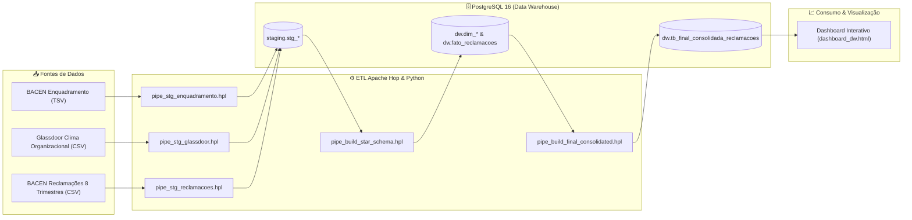

# 📊 Atividade 1 – Ingestão e Pipeline de Dados (BACEN & Glassdoor)

Solução completa e reprodutiva de Engenharia de Dados para a **Atividade 1** da disciplina **Ingestão e Pipeline de Dados (eEDB-022)** da pós-graduação em Engenharia de Dados e Big Data (**PECE/POLI-USP**), ministrada pelo Prof. MSc. Leandro Mendes Ferreira.

---

## 🎯 Objetivos do Projeto
1. **Ferramenta Visual & Headless de ETL**: Orquestração e pipelines construídos no **Apache Hop** (`.hpl` e `.hwk`).
2. **Ingestão em RDBMS Open Source**: Persistência no **PostgreSQL 16** com schemas `staging` e `dw`.
3. **Modelagem Dimensional (Star Schema)**: Construção de dimensões (`dim_instituicao`, `dim_tempo`, `dim_clima_organizacional`) e da tabela fato (`fato_reclamacoes`).
4. **Tabela Final Consolidada**: Visão unificada e saneada de negócios (`dw.tb_final_consolidada_reclamacoes`).
5. **Infraestrutura como Código (IaC) & Conteinerização**: Uso de **Docker Compose** e **Terraform**.
6. **Reprodutibilidade em 1 Comando**: Execução end-to-end automatizada via script orquestrador.

---

## 🏗️ Arquitetura do Pipeline de Dados



---

## 📁 Estrutura de Diretórios do Repositório

```text
.
├── docker/
│   ├── docker-compose.yml           # PostgreSQL 16 DW e Apache Hop Web GUI Container
│   └── postgres/init/01_init_db.sql # Script de inicialização das permissões e banco eedb_dw
├── terraform/
│   ├── main.tf                      # Provisionamento IaC dos Schemas staging e dw
│   ├── variables.tf                 # Declaração das variáveis de conexão
│   ├── terraform.tfvars             # Configuração de parâmetros de ambiente
│   └── outputs.tf                   # Saídas dos recursos criados
├── sql/
│   ├── 01_create_staging_tables.sql # DDL da camada Staging
│   ├── 02_create_star_schema.sql    # DDL das Dimensões e Fato (Star Schema)
│   └── 03_create_final_table.sql    # DDL da Tabela Final Consolidada
├── hop/
│   ├── metadata/rdbms/              # Definição oficial de conexões JDBC RDBMS do Hop
│   ├── pipelines/                   # Pipelines de ETL (.hpl)
│   │   ├── pipe_stg_enquadramento.hpl
│   │   ├── pipe_stg_glassdoor.hpl
│   │   ├── pipe_stg_reclamacoes.hpl
│   │   ├── pipe_build_star_schema.hpl
│   │   └── pipe_build_final_consolidated.hpl
│   └── workflows/
│       └── wf_main_etl.hwk          # Workflow orquestrador visual principal
├── Dados/                           # Fontes de Dados (BACEN e Glassdoor)
│   ├── Bancos/                      # Enquadramento BACEN (S1 a S5)
│   ├── Empregados/                  # Avaliações Glassdoor
│   └── Reclamações/                 # 8 Trimestres de Reclamações BACEN (2021-2022)
├── docs/
│   ├── dashboard_dw.html            # Dashboard Analítico Interativo (Chart.js)
│   └── evidencias/                  # Screenshots das Evidências de Execução (.png)
├── scripts/
│   ├── run_all.ps1                  # 🚀 Script de Execução Automatizada E2E (1-Command)
│   └── execute_hop_pipeline.py      # Executor Python Headless & Orquestrador SQL
├── RELATORIO_FINAL_EVIDENCIAS.md    # Relatório Completo com Evidências de Validação
└── README.md                        # Documentação do Repositório
```

---

## ⚡ Reprodutibilidade Completa (Como Executar)

### 📌 Pré-requisitos
- **Docker Desktop** (com Docker Compose ativo)
- **Python 3.8+**
- **Terraform 1.0+** (opcional, orquestrado automaticamente pelo script)

### 🚀 Execução em 1 Comando

**No Windows (PowerShell):**
```powershell
.\scripts\run_all.ps1
```

**No Linux / macOS (Bash):**
```bash
chmod +x ./run_all.sh
./run_all.sh
```

### 🔄 O que o script orquestrador realiza automaticamente:
1. **Subida da Infraestrutura Docker**: Levanta o PostgreSQL 16 (`postgres_dw`) e a GUI do Apache Hop (`hop_web_gui`).
2. **Provisionamento IaC (Terraform)**: Cria declarativamente os schemas `staging` e `dw` no banco `eedb_dw`.
3. **Ingestão e Processamento E2E**: Cria as tabelas, ingere os dados dos 8 trimestres do BACEN, enquadramento e Glassdoor, carrega a modelagem Star Schema e popula a tabela final consolidada (`dw.tb_final_consolidada_reclamacoes`).
4. **Validação Automática**: Executa consultas SQL no banco e exibe o resumo de volumetria no terminal.

---

## 🌐 Acesso às Ferramentas e Dashboards

| Ferramenta / Recurso | URL / Acesso | Credenciais / Notas |
| :--- | :--- | :--- |
| **Apache Hop Web GUI** | `http://localhost:8080` | Interface visual de ETL |
| **PostgreSQL 16 DW** | `localhost:5432` | `db: eedb_dw` \| `user: postgres` \| `pass: postgres` |
| **Dashboard Analítico HTML** | `file:///.../docs/dashboard_dw.html` | Dashboard interativo em tema dark |
| **Relatório de Evidências** | `RELATORIO_FINAL_EVIDENCIAS.md` | Documento com prints e métricas do projeto |

---

## 📊 Consulta SQL de Exemplo (Validação no PostgreSQL)

Para consultar o resumo consolidado direto no PostgreSQL:

```sql
SELECT 
    segmento, 
    COUNT(DISTINCT nome_instituicao) AS total_instituicoes,
    SUM(qtd_total_reclamacoes) AS total_reclamacoes,
    ROUND(AVG(score_geral_glassdoor)::numeric, 2) AS media_satisfacao_glassdoor
FROM dw.tb_final_consolidada_reclamacoes
GROUP BY segmento
ORDER BY total_reclamacoes DESC;
```

---

## 👥 Equipe
- **Antonio Daniel de Souza Linhares**
- **Yuri Alexandre Barbosa Rodrigues**
- **Hercules Ramos Veloso de Freitas**

---

## 📜 Licença e Créditos
Desenvolvido como projeto prático da pós-graduação **eEDB-022: Ingestão e Pipeline de Dados** - **PECE / POLI-USP**.

