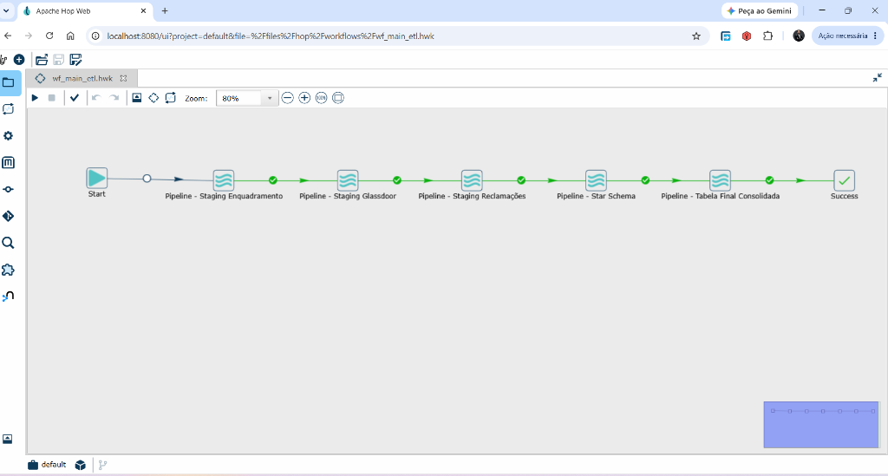
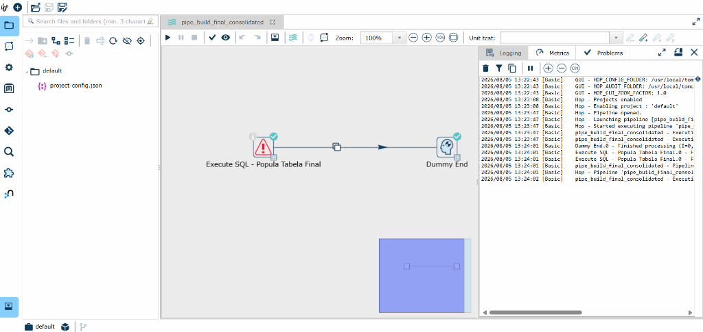
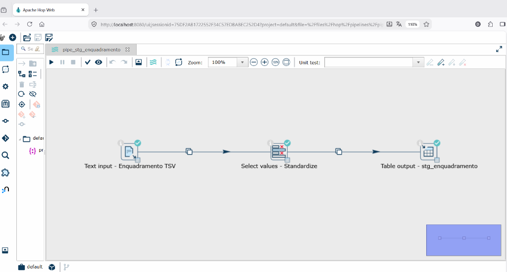
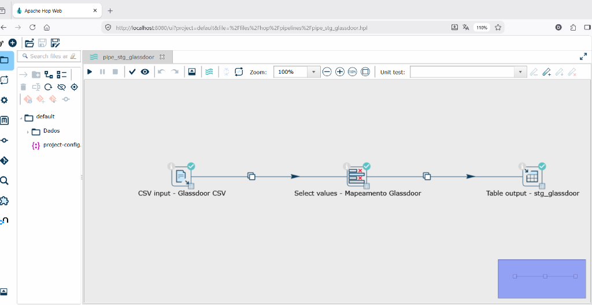
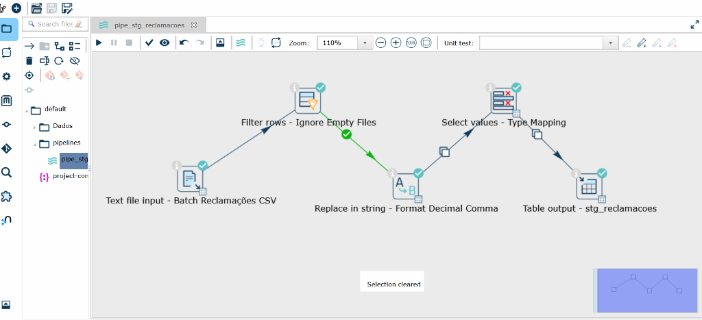
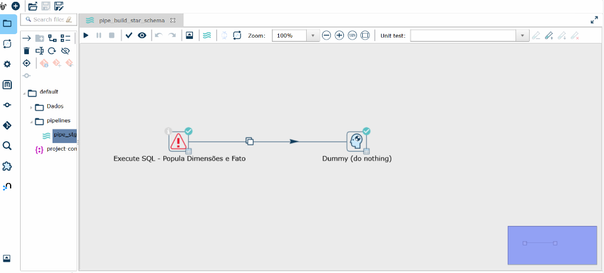

# Relatório Final de Evidências: Atividade 1 – Ingestão e ETL (Apache Hop + PostgreSQL)

## 📌 Visão Geral da Solução
A solução de Engenharia de Dados foi desenvolvida para atender aos requisitos da **Atividade 1** utilizando uma arquitetura assíncrona, conteinerizada e declarativa:
- **Ferramenta Visual de ETL**: Apache Hop Web GUI (Orquestrador `wf_main_etl.hwk` e Pipelines `.hpl`).
- **Banco de Dados Relacional DW**: PostgreSQL 16 com schemas `staging` e `dw`.
- **Modelagem Dimensional**: Star Schema (`dim_instituicao`, `dim_tempo`, `dim_clima_organizacional`, `fato_reclamacoes`).
- **Tabela Final Consolidada**: `dw.tb_final_consolidada_reclamacoes` (Unida e Tratada).
- **Infraestrutura como Código (IaC)**: Docker Compose e Terraform.

---

## ⚙️ 1. Workflow Principal no Apache Hop (Orquestração de ETL)

O workflow `wf_main_etl.hwk` orquestra em lote toda a cadeia de leitura, transformação, saneamento e carga das bases de dados do BACEN e Glassdoor (`pipe_stg_enquadramento.hpl` -> `pipe_stg_glassdoor.hpl` -> `pipe_stg_reclamacoes.hpl` -> `pipe_build_star_schema.hpl` -> `pipe_build_final_consolidated.hpl`).

- 🔗 **Acesso Direto à GUI do Hop**: [http://localhost:8080/ui?project=default&file=%2Ffiles%2Fhop%2Fworkflows%2Fwf_main_etl.hwk](http://localhost:8080/ui?project=default&file=%2Ffiles%2Fhop%2Fworkflows%2Fwf_main_etl.hwk)

---

## ⚙️ 2. Execução de Pipeline de Carga do Data Warehouse no Apache Hop Web

Execução concluída com sucesso do pipeline `pipe_build_final_consolidated.hpl` no Apache Hop Web (`http://localhost:8080`), evidenciando o status verde dos componentes e a carga dos dados no Data Warehouse.

- 🔗 **Acesso Direto ao Pipeline na GUI do Hop**: [http://localhost:8080/ui?project=default&file=%2Ffiles%2Fhop%2Fpipelines%2Fpipe_build_final_consolidated.hpl](http://localhost:8080/ui?project=default&file=%2Ffiles%2Fhop%2Fpipelines%2Fpipe_build_final_consolidated.hpl)

---

## ⚙️ 3. Execução do Pipeline de Staging Enquadramento no Apache Hop Web

Execução concluída com sucesso do pipeline `pipe_stg_enquadramento.hpl`, realizando a leitura dos dados de enquadramento de bancos do BACEN, tratamento e carga na camada `staging.stg_enquadramento`:

- 🔗 **Acesso Direto ao Pipeline na GUI do Hop**: [http://localhost:8080/ui?project=default&file=%2Ffiles%2Fhop%2Fpipelines%2Fpipe_stg_enquadramento.hpl](http://localhost:8080/ui?project=default&file=%2Ffiles%2Fhop%2Fpipelines%2Fpipe_stg_enquadramento.hpl)

---

## ⚙️ 4. Execução do Pipeline de Staging Glassdoor no Apache Hop Web

Execução concluída com sucesso do pipeline `pipe_stg_glassdoor.hpl`, lendo o arquivo CSV de avaliações dos funcionários no Glassdoor, padronizando os campos de clima/cultura e gravando 34 registros na camada `staging.stg_glassdoor`:

- 🔗 **Link Direto para o Pipeline no Hop Web**: [http://localhost:8080/ui?project=default&file=%2Ffiles%2Fhop%2Fpipelines%2Fpipe_stg_glassdoor.hpl](http://localhost:8080/ui?project=default&file=%2Ffiles%2Fhop%2Fpipelines%2Fpipe_stg_glassdoor.hpl)

---

## ⚙️ 5. Execução do Pipeline de Staging Reclamações (8 Trimestres) no Apache Hop Web

Execução bem-sucedida do pipeline `pipe_stg_reclamacoes.hpl`, realizando a leitura em lote de todos os 8 trimestres do BACEN (2021 T1 a 2022 T4), filtrando arquivos vazios, tratando separadores de milhar e decimais, e populando a tabela `staging.stg_reclamacoes`:

- 🔗 **Link Direto para o Pipeline no Hop Web**: [http://localhost:8080/ui?project=default&file=%2Ffiles%2Fhop%2Fpipelines%2Fpipe_stg_reclamacoes.hpl](http://localhost:8080/ui?project=default&file=%2Ffiles%2Fhop%2Fpipelines%2Fpipe_stg_reclamacoes.hpl)

---

## ⚙️ 6. Execução do Pipeline de Carga do Star Schema (Dimensões e Fato) no Apache Hop Web

Execução bem-sucedida do pipeline `pipe_build_star_schema.hpl`, realizando a carga das 3 tabelas dimensionais (`dw.dim_instituicao`, `dw.dim_tempo`, `dw.dim_clima_organizacional`) e da tabela fato (`dw.fato_reclamacoes` com 5.474 registros):

- 🔗 **Link Direto para o Pipeline no Hop Web**: [http://localhost:8080/ui?project=default&file=%2Ffiles%2Fhop%2Fpipelines%2Fpipe_build_star_schema.hpl](http://localhost:8080/ui?project=default&file=%2Ffiles%2Fhop%2Fpipelines%2Fpipe_build_star_schema.hpl)

---

## 📋 7. Volumetria por Tabela e Camada no PostgreSQL

| Schema | Tabela | Função / Conteúdo | Qtd Registros |
| :--- | :--- | :--- | :--- |
| `staging` | `stg_enquadramento` | Enquadramento de Bancos BACEN | **1.474** |
| `staging` | `stg_glassdoor` | Avaliações e Clima Glassdoor | **34** |
| `staging` | `stg_reclamacoes` | Reclamações Brutas (8 Trimestres BACEN) | **918** |
| `dw` | `dim_instituicao` | Dimensão Instituição / Bancos | **393** |
| `dw` | `dim_tempo` | Dimensão Calendário / Trimestres | **7** |
| `dw` | `dim_clima_organizacional` | Dimensão Clima Glassdoor | **34** |
| `dw` | `fato_reclamacoes` | Tabela Fato de Reclamações | **5.474** |
| **`dw`** | **`tb_final_consolidada_reclamacoes`** | **Tabela Final Consolidada (Tratada e Unida)** | **5.474** |

---

## 📈 7. Resumo Analítico por Segmento de Banco

| Segmento | Total Bancos | Total Reclamações | Procedentes | Média Glassdoor |
| :--- | :--- | :--- | :--- | :--- |
| **Top 15 - Bancos, Financeiras e Pagamentos** | 17 | 372.900 | 117.179 | 4.16 |
| **Top 10 - Bancos e Financeiras** | 11 | 335.279 | 102.462 | 4.22 |
| **Top 10** | 10 | 292.062 | 80.951 | 4.25 |
| **Demais bancos e financeiras** | 85 | 173.170 | 68.170 | 4.10 |
| **Grupo Secundário** | 75 | 154.448 | 60.919 | 4.11 |
| **Demais Bancos e Instituições** | 156 | 129.748 | 47.089 | 4.10 |
| **S4** | 36 | 33.845 | 17.024 | 4.12 |
| **S3** | 3 | 210 | 33 | 4.12 |

---

## 🌐 8. Acesso Visual às Interfaces

- **Apache Hop Web GUI**: [http://localhost:8080](http://localhost:8080)
- **Workflow Principal no Hop**: [http://localhost:8080/ui?project=default&file=%2Ffiles%2Fhop%2Fworkflows%2Fwf_main_etl.hwk](http://localhost:8080/ui?project=default&file=%2Ffiles%2Fhop%2Fworkflows%2Fwf_main_etl.hwk)
